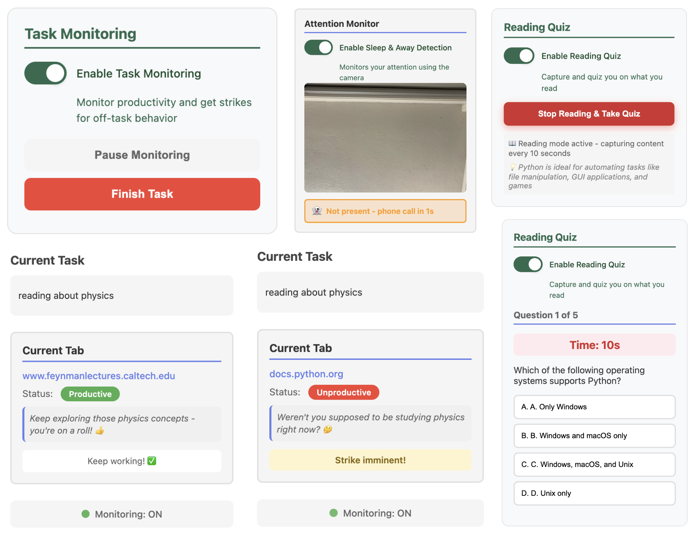

# BigBro



A Chrome extension, web app, and Python vision server that work together to monitor your focus. It analyzes your on-screen activity with AI and your attention via webcam + computer vision, escalating consequences (strikes, calls) when you drift off-task.

## Getting Started

### Prerequisites
- Google Chrome
- Python 3.10+
- A Supabase project (URL + anon key)
- Relevant API keys (Claude required; optional services enable extras)

### 1) Configure keys and environment
- Copy templates and fill values:
  - `cp config_template.js config.js`
  - `cp webapp/config_template.js webapp/config.js`
- Copy the environment example, then edit your values:
  - `cp .env.example .env`
- See [SECURITY.md](SECURITY.md) for sensitive file handling.

### 2) Start the vision server (Python)
```bash
cd vision
python -m venv venv
# macOS/Linux
source venv/bin/activate
# Windows PowerShell
venv\Scripts\Activate.ps1

pip install -r requirements.txt
python vision_server.py
```
- Verify: open http://localhost:8080/status  
- Server entry: [vision/vision_server.py](vision/vision_server.py)

### 3) Run the web app (static)
```bash
cd webapp
python -m http.server 8000
# open:
# http://localhost:8000
```
- Main entry: [webapp/index.html](webapp/index.html)

### 4) Load the Chrome extension
- Chrome → chrome://extensions → enable Developer mode → Load unpacked → select the project folder.
- Ensure config.js exists (from step 1).

### Typical flow
1. Start the vision server.
2. Open the web app at http://localhost:8000, sign up/in, save phone numbers (Settings), click “Start Session”.
3. Open the extension popup, set your task, and start monitoring.

### Troubleshooting
- Vision server: check http://localhost:8080/status and the terminal running [vision/vision_server.py](vision/vision_server.py)
- Camera permissions: grant OS/browser access
- Calls not triggering: verify keys in config.js and .env; ensure phone numbers are saved in the web app
- Security tips and env keys: see [SECURITY.md](SECURITY.md)

---

## About the Project

### Inspiration
We’ve all been there—opening a laptop to work, only to end up on YouTube, Reddit, or social media. Traditional blockers are easy to bypass. BigBro brings external accountability into your workflow with AI and computer vision—so you stay focused.

### What it does
- Task Monitoring
  - The extension captures a tab screenshot plus URL and stated task, then asks Claude if you’re on-task. Strikes accumulate while off-task.
- Attention Monitoring
  - The Python server tracks facial landmarks (MediaPipe) and head pose (OpenCV solvePnP) to detect:
    - Sleeping: sustained eye closure triggers an AI-generated TTS wake-up (Fish Audio)
    - Looking Away: sustained yaw/pitch deviation → strike
    - Not Present: extended absence triggers a phone call via Vapi
- Strike System
  - Two strikes escalate to calling your accountability partner via Vapi.
- Analytics Dashboard
  - The web app shows productivity stats and session history (Supabase-backed).

### How we built it
- Chrome Extension (Frontend)
  - Manifest V3 service worker orchestrates monitoring and communicates with the vision server; popup for task and controls.
- Vision Analysis System (Python/Flask)
  - Server at port 8080: [vision/vision_server.py](vision/vision_server.py)
  - MediaPipe Face Mesh (468 landmarks) + OpenCV solvePnP/Rodrigues for yaw/pitch; EAR for eye closure
  - Four-state machine: focused, sleeping, looking_away, not_present
- AI Integration
  - Claude (Anthropic) for on-task classification and feedback
- Alert Systems
  - Fish Audio for local TTS; Vapi for real phone calls
- Data Layer
  - Supabase (PostgreSQL) for auth, settings, strikes, sessions, and events

### Challenges we ran into
- 3D head pose estimation: mapping 2D landmarks to stable 3D pose with solvePnP/Rodrigues
- Priority logic for overlapping states (sleeping > looking_away) and timer resets
- Real-time performance: CPU-only pipeline with sub-500ms end-to-end latency
- Prompt engineering for nuanced “on-task/off-task” calls
- MV3 service worker lifecycle constraints

### Accomplishments
- Reliable MediaPipe + OpenCV integration for real-time head pose
- Multi-tier accountability: notifications → strikes → phone calls
- Seamless cross-component integration via Supabase and a clean server API
- Real-world effectiveness in preventing procrastination

### What we learned
- Facial landmarks, solvePnP, Rodrigues, Euler angles, EAR
- Practical state machines for overlapping detection
- Accountability design changes behavior
- Multi-API integration with error handling and rate limits

### What’s next
- Adaptive thresholds per user (context memory) to reduce false positives
- Mobile companion app for away-from-desk tracking
- Team accountability and shared stats
- Sentiment/expression analysis for proactive assistance
